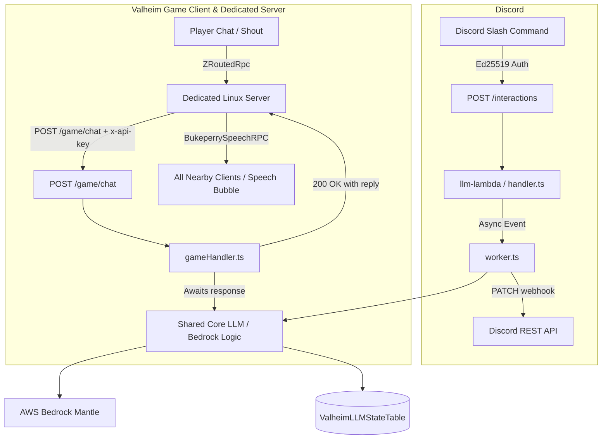

# Bukeperry: In-Game AI Companion & Discord Bot for Valheim 🌲

Bukeperry is an interactive AI companion for [Valheim](https://www.valheimgame.com/), featuring:
- **In-Game C# Companion Mod (`mod/`)**: Custom passive/retaliatory troll trader NPC with custom stats (15,000 HP, 1,000 DMG), speech bubbles, trade interactions, and conversational AI triggered by player proximity chat and shouts.
- **Serverless AWS Bedrock LLM Backend (`llm-lambda/`)**: Generative AI bot powered by `google.gemma-4-31b` via AWS Bedrock Mantle, with local RAG knowledge retrieval and persistent multi-turn conversation memory in DynamoDB.
- **Discord Integration & In-Game Chat Endpoint**: API Gateway exposing `/interactions` for Discord slash commands (`/bukeperry`, `/bukeperry-reset`) and `/game/chat` with API Key authentication for in-game chat synchronization.
- **AWS CDK Infrastructure (`cdk/`)**: Automated cloud infrastructure definitions deploying stack `ValheimLLM`.
- **Distribution & Installation Tooling (`mod/scripts/`)**: Automated Thunderstore packaging (`publish.sh`), headless Linux server installer (`install-server.sh`), and server bundle packager (`package-server-bundle.sh`).

---

## 🏗️ Architecture



---

## 🛠️ Project Structure

- **`mod/`**:
  - `BukeperryMod/`: C# .NET Standard 2.1 source code (BepInEx 5 & Jötunn).
  - `dist/`: Build outputs (`BukeperryMod.dll`, `bukeperry-server-bundle-v*.zip`).
  - `scripts/`: Packaging, deployment, and server installer scripts.
    - `macos-deploy.sh`: Local build and Mac client deployment.
    - `package-server-bundle.sh`: Assembles dedicated server zip bundle.
    - `install-server.sh`: Idempotent dedicated server installer for Linux hosts.
    - `thunderstore/`: Thunderstore package metadata, icon, and `publish.sh`.
- **`llm-lambda/`**:
  - `src/core.ts`: Bedrock prompt orchestration, persona formatting, and DynamoDB history.
  - `src/handler.ts`: Discord interaction webhook handler.
  - `src/worker.ts`: Discord background worker.
  - `src/gameHandler.ts`: Synchronous in-game chat endpoint (`POST /game/chat`).
  - `src/retriever.ts`: Local RAG engine querying `src/data/valheim_knowledge.json`.
- **`cdk/`**:
  - `lib/llm-stack.ts`: CDK stack `ValheimLLM` (API Gateway, Lambdas, DynamoDB, API Key, Usage Plan).

---

## 🚀 Quick Commands

### Build Mod & Deploy Locally
```bash
./mod/scripts/macos-deploy.sh
```

### Package Dedicated Server Bundle
```bash
./mod/scripts/package-server-bundle.sh
```

### Run Unit Tests
```bash
cd llm-lambda && npm test
```

### Deploy Cloud Infrastructure (CDK)
```bash
cd cdk && npm run deploy
```
